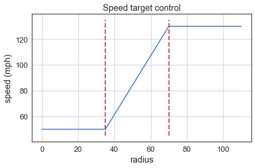

# CarND-Controls-MPC
Self-Driving Car Engineer Nanodegree Program

---

## Description

The purpose of this project is to design a Model Predictive Controller (MPC) to steer and accelerate a car around a track in the simulator. 

The simulator provides the global position, the heading, the speed of the car, and the global coordinates of waypoints along the reference trajectory that the car should follow. 

The units of all the magnitudes must match the model to avoid problems. For example, assuming that the positions are provided in meters while the speed is provided in miles per hour, and the time is handled in seconds, the speed should be converted to meters per second.

### Vehicle Model

The vehicle model used is the **kinematic bicycle**. It models the car as a bicycle, with neglected width, and it ignores all forces and masses. The model is implemented with the following equations:

	x(t+1)    = x(t) + v(t) * cos(psi(t)) * dt
	y(t+1)    = y(t) + v(t) * sin(psi(t)) * dt
	v(t+1)    = v(t) + a(t) * dt
	psi(t+1)  = psi(t) + v(t) / Lf * delta(t) * dt
	epsi(t+1) = psi(t) - psides(t) + v(t) / Lf * delta(t) * dt
	cte(t+1)  = f(x(t)) - y(t) + v(t) * sin(epsi(t)) * dt

where, `x`, `y` are the coordinates of the position of the car, `psi` is the heading, `v` is the speed, `cte` the cross-track error and `epsi` the orientation error. 

`delta` and `a` are the actuators: the steering angle and the throttle. In this model, we are assuming that the throttle is equal (or proportional) to the acceleration. 

`Lf` is the distance from the center of gravity of the vehicle to the from wheels. It's a parameter dependent of the car affecting its maneuverability in the turns.

This model is implemented in the class `FG_eval` (file `MPC.cpp`) as constraints for the predictive model.

### Latency

This model simulates a latency in the actuators of 100 ms. And extra of 50 ms is added to account for the computation time. To handle the latency, the kinematic model is used to predict the state on the car 150 ms in the future from the state given by the simulator. The full code is in `main.cpp`:


### Model Predictive Controller

The model is computed in the coordinate system of the car. For that the waypoints (`ptsx`, `ptsy`) are converted to this system with the following affine transformation:

	ptsx_v[i] =   (ptsx[i] - px) * cos(psi) + (ptsy[i] - py) * sin(psi);
   	ptsy_v[i] = - (ptsx[i] - px) * sin(psi) + (ptsy[i] - py) * cos(psi);
   	
Then a polynomial or third order is fitted on the waypoints to get the approximate curve.

	coeffs = polyfit(ptsx_v, ptsy_v, 3)

The crosstrack error (CTE) to this reference curve is approximated with the horizontal distance at the origin (`x=y=0` in the car reference):

	cte = coeffs[0]
	
Code to the compute the exact CTE by minimising the squared distance of the polynomial to the origin is also included but not used because the previous approximation is good enough.

At this point the state of the car in its own reference can be feeded to the MPC solver:

	state << 0, 0, 0, v, cte, epsi;
	
### Prediction Horizon

The MPC solver computes an optimal trajectory under the model constrains for the next `N` time steps, each time step having a constant duration `dt`. The timestep length and duration, `N` and `dt`, define the prediction horizon `N * dt`. There is a tradeoff between accuracy, smoothness and computation time. A smaller `dt` smoothes the effect of the actuators. A larger `N` will increase the computation time affecting the feasibility of computing the model in real time. For the simulator a horizon between 1 and 2 seconds is sufficient, therefore the values choosen are:

	N = 15
	dt = 0.1

These values give a horizon of 1.5 seconds with enough smoothness to drive the car around the track at good speeds.

### Cost function

The cost function used is quadratic in the cte, epsi and speed errors. It's also quadratic in the actuators and their derivatives. The constrains for the solution are the equations of the kinematic model and the limits of the actuators. In pseucode, the cost is implemented in this way (see `MPC.cpp` for the full details): 
	
	cost(t) = 
	// Minimize the state error cost
	  Wcte    * Sum[(cte(t) - ref_cte)^2, t=0, t=N] 
	+ Wepsi   * Sum[(epsi(t) - ref_epsi)^2, t=0, t=N]
	+ Wv      * Sum[(v(t) - ref_v)^2, t=0, t=N]
	// Minimize the use of actuators
	+ Wdelta  * Sum[delta(t)^2, t=0, t=N-1]
	+ Wa      * Sum[a(t)^2, t=0, t=N-1]
	// Minimize the gap between sequential actuations
	+ Wddelta * Sum[(delta(t+1) - delta(t))^2, t=0, t=N-2]
	+ Wa      * Sum[(a(t+1) - a(t))^2, t=0, t=N-2]

where the following weights are used:
	
	Wcte       =    0.7
	Wepsi      =   50.0
	Wdelta     =   50.0
	Wddelta    =    1e3
	Wv         =    0.1
	Wa         =    0.1
	Wda        =    0.1

### Target Speed 

The target speed is dependent on the radius of curvature in the way describe in the following image:



Two thresholds in the radius of 35 and 70 separate the speed target in 3 regions, from a low, safe speed of 50 mph upto the maximum target.

The radius of curvature is approximated computing the radius of curvature of second order polynomial fit to the waypoints 5 meters ahead of the car. This is chosen instead of reusing the third order polynomial because it seems to give more robust values. The 5 meters margin is used to give time to the actuators to effect a change.

### Result

With this controller, the car can drive around the track reaching speeds around 100 mph. 

![[Video][video.mp4]](MPC.gif)

## Dependencies

* cmake >= 3.5
 * All OSes: [click here for installation instructions](https://cmake.org/install/)
* make >= 4.1
  * Linux: make is installed by default on most Linux distros
  * Mac: [install Xcode command line tools to get make](https://developer.apple.com/xcode/features/)
  * Windows: [Click here for installation instructions](http://gnuwin32.sourceforge.net/packages/make.htm)
* gcc/g++ >= 5.4
  * Linux: gcc / g++ is installed by default on most Linux distros
  * Mac: same deal as make - [install Xcode command line tools]((https://developer.apple.com/xcode/features/)
  * Windows: recommend using [MinGW](http://www.mingw.org/)
* [uWebSockets](https://github.com/uWebSockets/uWebSockets)
  * Run either `install-mac.sh` or `install-ubuntu.sh`.
  * If you install from source, checkout to commit `e94b6e1`, i.e.
    ```
    git clone https://github.com/uWebSockets/uWebSockets 
    cd uWebSockets
    git checkout e94b6e1
    ```
    Some function signatures have changed in v0.14.x. See [this PR](https://github.com/udacity/CarND-MPC-Project/pull/3) for more details.
* Fortran Compiler
  * Mac: `brew install gcc` (might not be required)
  * Linux: `sudo apt-get install gfortran`. Additionall you have also have to install gcc and g++, `sudo apt-get install gcc g++`. Look in [this Dockerfile](https://github.com/udacity/CarND-MPC-Quizzes/blob/master/Dockerfile) for more info.
* [Ipopt](https://projects.coin-or.org/Ipopt)
  * Mac: `brew install ipopt`
  * Linux
    * You will need a version of Ipopt 3.12.1 or higher. The version available through `apt-get` is 3.11.x. If you can get that version to work great but if not there's a script `install_ipopt.sh` that will install Ipopt. You just need to download the source from the Ipopt [releases page](https://www.coin-or.org/download/source/Ipopt/) or the [Github releases](https://github.com/coin-or/Ipopt/releases) page.
    * Then call `install_ipopt.sh` with the source directory as the first argument, ex: `bash install_ipopt.sh Ipopt-3.12.1`. 
  * Windows: TODO. If you can use the Linux subsystem and follow the Linux instructions.
* [CppAD](https://www.coin-or.org/CppAD/)
  * Mac: `brew install cppad`
  * Linux `sudo apt-get install cppad` or equivalent.
  * Windows: TODO. If you can use the Linux subsystem and follow the Linux instructions.
* [Eigen](http://eigen.tuxfamily.org/index.php?title=Main_Page). This is already part of the repo so you shouldn't have to worry about it.
* Simulator. You can download these from the [releases tab](https://github.com/udacity/self-driving-car-sim/releases).
* Not a dependency but read the [DATA.md](./DATA.md) for a description of the data sent back from the simulator.


## Basic Build Instructions


1. Clone this repo.
2. Make a build directory: `mkdir build && cd build`
3. Compile: `cmake .. && make`
4. Run it: `./mpc`.

## Tips

1. It's recommended to test the MPC on basic examples to see if your implementation behaves as desired. One possible example
is the vehicle starting offset of a straight line (reference). If the MPC implementation is correct, after some number of timesteps
(not too many) it should find and track the reference line.
2. The `lake_track_waypoints.csv` file has the waypoints of the lake track. You could use this to fit polynomials and points and see of how well your model tracks curve. NOTE: This file might be not completely in sync with the simulator so your solution should NOT depend on it.
3. For visualization this C++ [matplotlib wrapper](https://github.com/lava/matplotlib-cpp) could be helpful.

## Editor Settings

We've purposefully kept editor configuration files out of this repo in order to
keep it as simple and environment agnostic as possible. However, we recommend
using the following settings:

* indent using spaces
* set tab width to 2 spaces (keeps the matrices in source code aligned)

## Code Style

Please (do your best to) stick to [Google's C++ style guide](https://google.github.io/styleguide/cppguide.html).

## Project Instructions and Rubric

Note: regardless of the changes you make, your project must be buildable using
cmake and make!

More information is only accessible by people who are already enrolled in Term 2
of CarND. If you are enrolled, see [the project page](https://classroom.udacity.com/nanodegrees/nd013/parts/40f38239-66b6-46ec-ae68-03afd8a601c8/modules/f1820894-8322-4bb3-81aa-b26b3c6dcbaf/lessons/b1ff3be0-c904-438e-aad3-2b5379f0e0c3/concepts/1a2255a0-e23c-44cf-8d41-39b8a3c8264a)
for instructions and the project rubric.

## Hints!

* You don't have to follow this directory structure, but if you do, your work
  will span all of the .cpp files here. Keep an eye out for TODOs.

## Call for IDE Profiles Pull Requests

Help your fellow students!

We decided to create Makefiles with cmake to keep this project as platform
agnostic as possible. Similarly, we omitted IDE profiles in order to we ensure
that students don't feel pressured to use one IDE or another.

However! I'd love to help people get up and running with their IDEs of choice.
If you've created a profile for an IDE that you think other students would
appreciate, we'd love to have you add the requisite profile files and
instructions to ide_profiles/. For example if you wanted to add a VS Code
profile, you'd add:

* /ide_profiles/vscode/.vscode
* /ide_profiles/vscode/README.md

The README should explain what the profile does, how to take advantage of it,
and how to install it.

Frankly, I've never been involved in a project with multiple IDE profiles
before. I believe the best way to handle this would be to keep them out of the
repo root to avoid clutter. My expectation is that most profiles will include
instructions to copy files to a new location to get picked up by the IDE, but
that's just a guess.

One last note here: regardless of the IDE used, every submitted project must
still be compilable with cmake and make./
